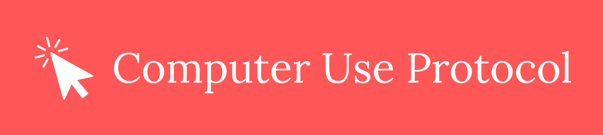

<p align="center">
  <a href="https://computeruseprotocol.com">
    
  </a>
</p>

<p align="center">
  <b>Python SDK for the Computer Use Protocol</b>
</p>

<br>

<p align="center">
  <a href="https://pypi.org/project/computeruseprotocol"></a>
  <a href="https://github.com/computeruseprotocol/python-sdk/blob/main/LICENSE"></a>
  <a href="https://github.com/computeruseprotocol/computeruseprotocol"></a>
</p>

The official Python SDK for the [Computer Use Protocol (CUP)](https://github.com/computeruseprotocol/computeruseprotocol) — a universal protocol for AI agents to perceive and interact with any desktop UI. This package provides tree capture, action execution, semantic search, and an MCP server for AI agent integration.

## Installation

```bash
pip install computeruseprotocol

# Linux additionally requires system packages
sudo apt install python3-gi gir1.2-atspi-2.0

# Web adapter (Chrome DevTools Protocol, works on any OS)
pip install computeruseprotocol[web]

# Screenshot support (mss; not needed on macOS)
pip install computeruseprotocol[screenshot]

# MCP server for AI agent integration
pip install computeruseprotocol[mcp]
```

## Quick start

```python
import cup

# Snapshot the foreground window — optimized for LLM context windows
screen = cup.snapshot()
print(screen)

# All windows
screen = cup.snapshot("full")

# Structured CUP envelope (dict) instead of compact text
envelope = cup.snapshot_raw()
```

Output:

```
# CUP 0.1.0 | windows | 2560x1440
# app: Spotify
# 63 nodes (280 before pruning)

[e0] win "Spotify" 120,40 1680x1020
  [e1] doc "Spotify" 120,40 1680x1020
    [e2] btn "Back" 132,52 32x32 [clk]
    [e3] btn "Forward" 170,52 32x32 {dis} [clk]
    [e7] nav "Main" 120,88 240x972
      [e8] lnk "Home" 132,100 216x40 {sel} [clk]
      [e9] lnk "Search" 132,148 216x40 [clk]
```

## CLI

```bash
# Print the foreground window tree (default)
python -m cup

# Filter by app name
python -m cup --scope full --app Discord

# Save JSON envelope to file
python -m cup --json-out tree.json

# Capture from Chrome via CDP
python -m cup --platform web --cdp-port 9222

# Include diagnostics (timing, role distribution, sizes)
python -m cup --verbose
```

## Platform support

| Platform | Adapter | Tree Capture | Actions |
|----------|---------|-------------|---------|
| Windows | UIA COM (comtypes) | Stable | Stable |
| macOS | AXUIElement (pyobjc) | Stable | Stable |
| Linux | AT-SPI2 (PyGObject) | Stable | Stable |
| Web | Chrome DevTools Protocol | Stable | Stable |
| Android | | Planned | Planned |
| iOS | | Planned | Planned |

CUP auto-detects your platform. Platform-specific dependencies (comtypes on Windows, pyobjc on macOS) are installed automatically.

## Architecture

```
cup/
├── __init__.py                 # Public API: snapshot, action, find, ...
├── __main__.py                 # CLI entry point
├── _base.py                    # Abstract PlatformAdapter interface
├── _router.py                  # Platform detection & adapter dispatch
├── format.py                   # Envelope builder, compact serializer, tree pruning
├── search.py                   # Semantic element search with fuzzy matching
├── actions/                    # Action execution layer
│   ├── executor.py             # ActionExecutor orchestrator
│   ├── _handler.py             # Abstract ActionHandler interface
│   ├── _keys.py                # Key name mapping utilities
│   ├── _windows.py             # Windows UIA actions
│   ├── _web.py                 # Chrome CDP actions
│   ├── _macos.py               # macOS actions (Quartz CGEvents + AX)
│   └── _linux.py               # Linux actions (XTest + AT-SPI2)
├── platforms/                  # Platform-specific tree capture
│   ├── windows.py              # Windows UIA adapter
│   ├── macos.py                # macOS AXUIElement adapter
│   ├── linux.py                # Linux AT-SPI2 adapter
│   └── web.py                  # Chrome CDP adapter
└── mcp/                        # MCP server integration
    ├── __main__.py             # python -m cup.mcp entry point
    └── server.py               # MCP protocol server
```

Adding a new platform means implementing `PlatformAdapter` — see [cup/_base.py](cup/_base.py) for the interface.

## MCP Server

CUP ships an MCP server for integration with AI agents (Claude, Copilot, etc.).

```bash
# Run directly
cup-mcp

# Or via Python
python -m cup.mcp
```

Add to your MCP client config (e.g., `.mcp.json` for Claude Code):

```json
{
    "mcpServers": {
        "cup": {
            "command": "cup-mcp",
            "args": []
        }
    }
}
```

**Tools:** `snapshot`, `snapshot_app`, `overview`, `snapshot_desktop`, `find`, `action`, `open_app`, `screenshot`

## Contributing

CUP is in early development (v0.1.0). Contributions welcome — especially:

- Android adapter (`cup/platforms/android.py`)
- iOS adapter (`cup/platforms/ios.py`)
- Tests — especially cross-platform integration tests
- Documentation and examples

For protocol or schema changes, please contribute to [computeruseprotocol](https://github.com/computeruseprotocol/computeruseprotocol).

See [CONTRIBUTING.md](CONTRIBUTING.md) for setup instructions and guidelines.

## Documentation

- **[API Reference](docs/api-reference.md)** — Session API, actions, envelope format, MCP server
- **[Protocol Specification](https://github.com/computeruseprotocol/computeruseprotocol)** — Schema, roles, states, actions, compact format

## License

[MIT](LICENSE)
